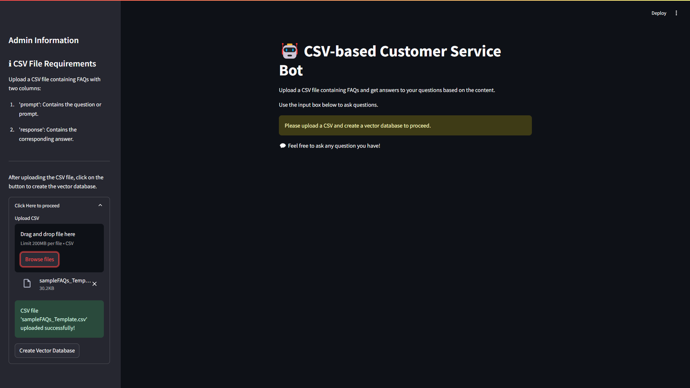
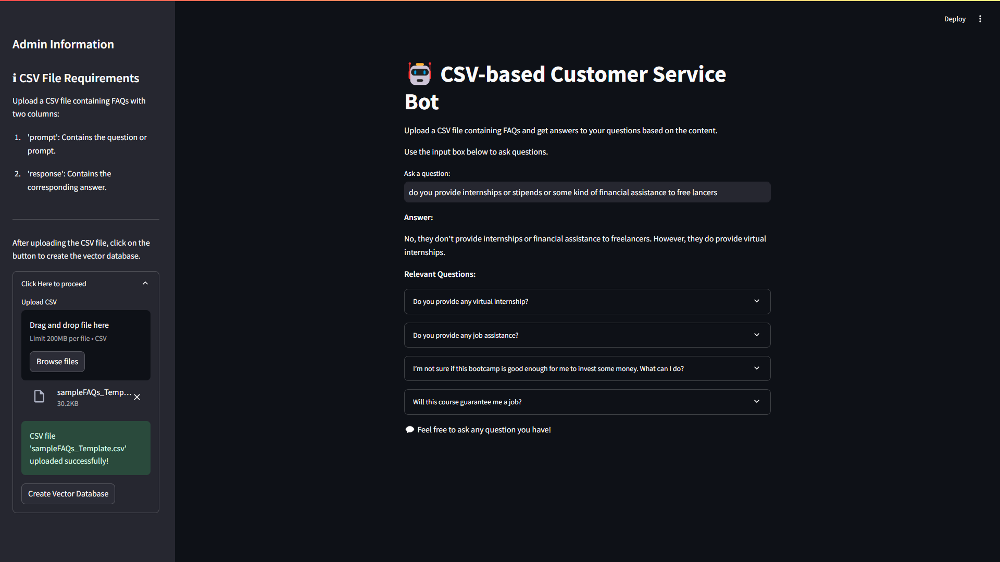

# Customer-Service-AI-Bot

DEMO: https://customer-service-ai-bot.streamlit.app/

## Features

*Upload CSV File:*
Users can upload a CSV file containing FAQs with two columns: 'prompt' (question or prompt) and 'response' (corresponding answer).

*Vector Database Creation:*
After uploading the CSV file, users can click on a button to create a vector database using the uploaded data.
The application uses *FAISS* (Fast Approximate Nearest Neighbors Search in High Dimensional Spaces) to store embeddings generated from the CSV data.

*Question-Answering System:*
Users can ask questions related to the content of the uploaded CSV (FAQs).
The application employs a retrieval-based question-answering (QA) system to find and display relevant answers from the CSV data.

*Integration with Language Models and Embeddings:*
Initializes a ChatGroq model (llm) for handling question-answering tasks.
Utilizes HuggingFaceEmbeddings for generating embeddings from the CSV data.

*Interactive User Interface:*
Displays a main title and instructions for using the application.
Provides a sidebar with administrative information, including CSV file requirements and instructions for uploading files and creating the vector database.

*Feedback and Status Updates:*
Displays success messages upon successful file uploads and vector database creations using st.success.
Warns users with a message (st.warning) if they attempt to use the question-answering feature without first uploading a CSV and creating a vector database.

*Source Document Exploration:*
Shows relevant source documents (FAQs) in expandable sections (st.expander), allowing users to explore the original prompts and responses used for generating answers.

*Session Management:*
Uses st.session_state to store and retrieve the vector database (vectordb), ensuring persistence across interactions with the application.

*User Interaction:*
Provides a text input box for users to input questions and receive answers based on the uploaded CSV data and generated vector database.

*User Guidance:*
Provides clear instructions and guidance throughout the UI to help users understand how to interact with the application effectively.
## Screenshot

